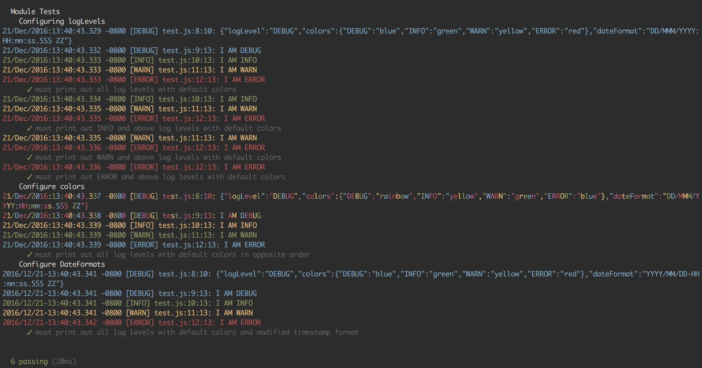

#  nodelogger

> A Lightweight Configurable Colorable Console Logger


## Install

```sh
$ npm install --save nodelogger
```

## Test

This assumes you have mocha installed.  If you do not install mocha with
```sh
$ npm install -g mocha
```
Then to run the test simple call mocha from the root project folder
```sh
$ mocha
```


## Default Configs
```js
{
	logLevel: 'INFO',
    colors: {
        DEBUG: 'blue',
        INFO: 'green',
        WARN: 'yellow',
        ERROR: 'red'
    },
    dateFormat: 'DD/MMM/YYYY:HH:mm:ss.SSS ZZ'
}
```

## Usage

```js

var nodelogger = require('git+https://github.com/dp1140a/nodeLogger.git#master');

log.init({config});
log.debug(message);
log.info(message);
log.warn(message);
log.error(message);

```

## License

MIT © [Dave Patton]()
